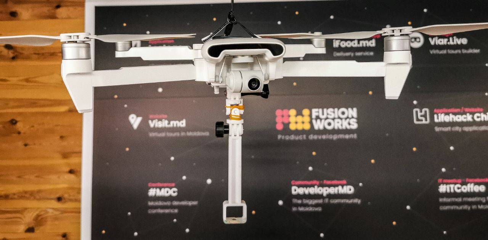
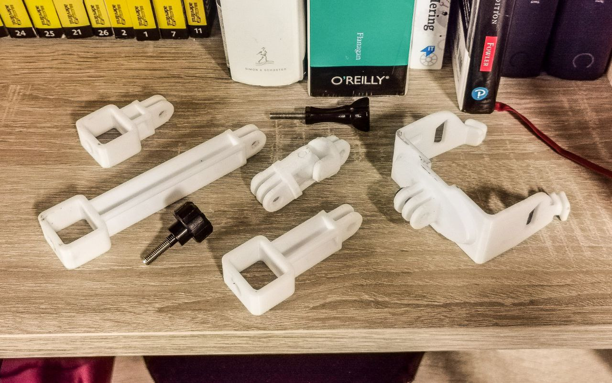
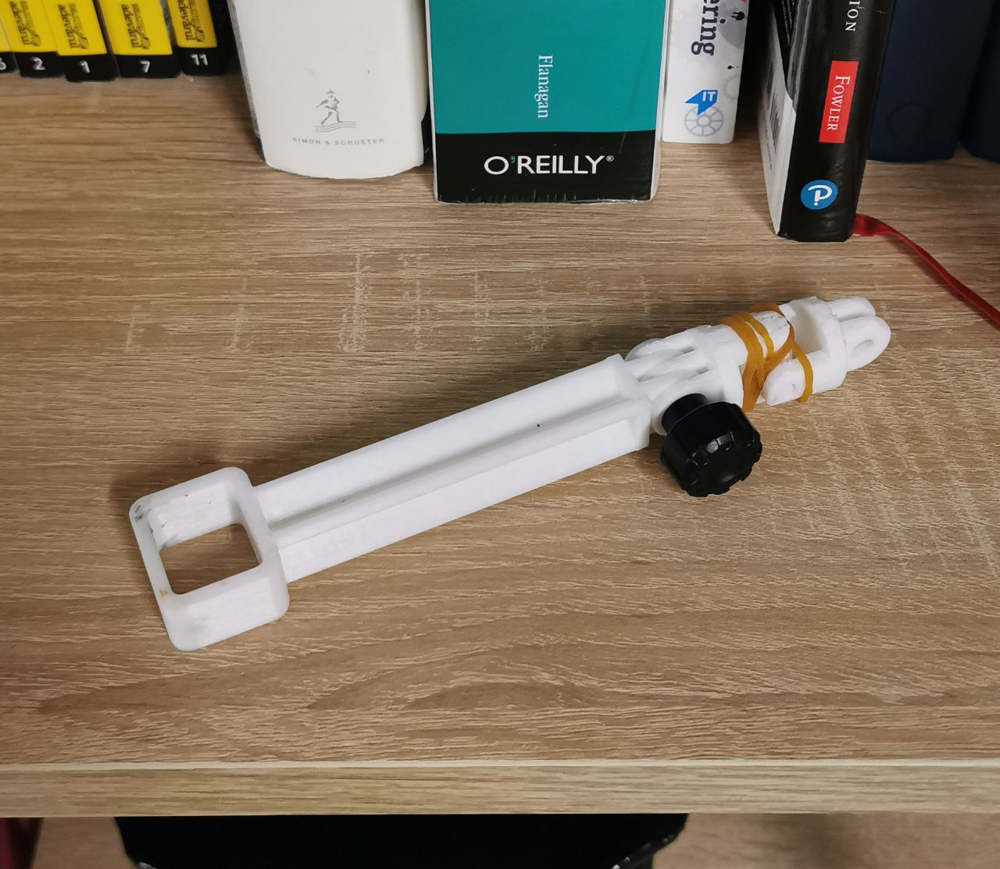

# Camera mount for FIMI X8 SE

## Description



This project enables mounting cameras with 1/4-20 UNC and GoPro connectors to FIMI X8 SE drone. Primarily it was developed for mounting my QooCam 8K under FIMI X8 drone. But eventually you can use it for any camera with compatible mount.   

I used this awesome [mount project](https://www.thingiverse.com/thing:3713687) from Thingverse as starting point and extended it using [this](https://www.thingiverse.com/thing:62800) and [this](https://www.thingiverse.com/thing:125939) libraries. Project is created using OpenSCAD so it is very easy to modify it. So feel free to open it in OpenSCAD and adjust to your needs or use pre-build components from [build](build/) folder.

## Components


Left to right: extenders, flexible joint, drone mount

### Drone mount with triple GoPro connector 

Source: [src/mount.scad](src/mount.scad)

Pre-build: [build/mount.stl](build/mount.stl)

### Extenders with double GoPro and 1/4-20 UNC connectors

Source: [src/extender.scad](src/extender.scad)

Pre-build: [build/extender30.stl](build/extender30.stl), [build/extender50.stl](build/extender50.stl), [build/extender.stl](build/extender.stl)

For my purposes I made GoPro-to-1/4 extenders since I was putting 360 camera under my drone. But you can easily convert it to GoPro-to-GoPro extender. Just take a look into [lib/gopro_mounts_mooncactus.scad](lib/gopro_mounts_mooncactus.scad) usage examples. 

You can create extender of any length by adjusting this line in source file%

```
extender(30);
```

There is several ready-to-use .stl's in build folder.

### Flexible joint 

Source: [src/flexible_extender.scad](src/flexible_extender.scad)

Pre-build: [build/flexible_joint.stl](build/flexible_joint.stl)

When I was trying to use approx. 100mm extender with my QooCam, drone became unstable so I decided to add a flexible joint in order to damp drone and camera movements. I also put some rubber bands around the joint for better damping.




## Happy flying and filming!

### PS: this is just my hobby :) For serious things that my company does (web and mobile development) - please visit [https://fusion.works](https://fusion.works)

